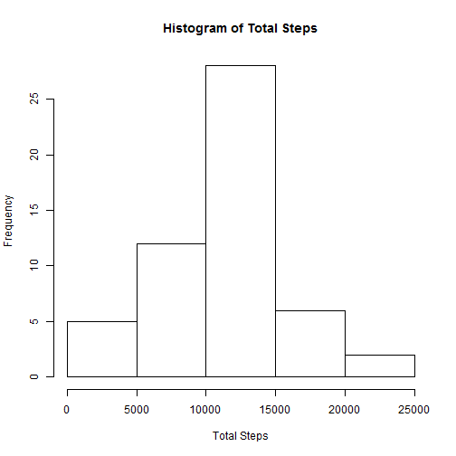
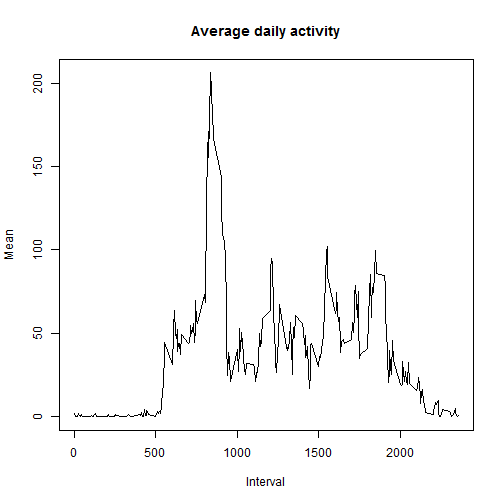
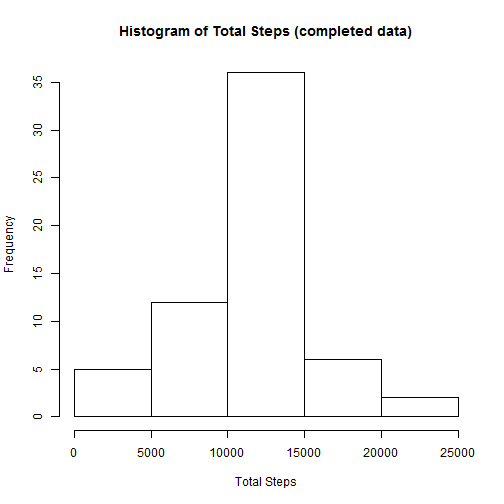
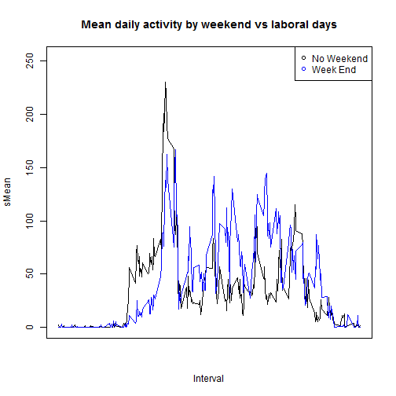
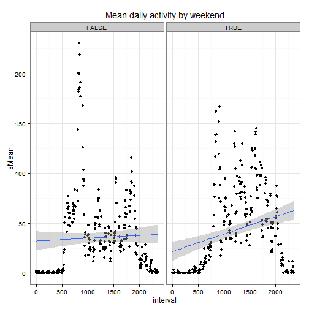

COURSE: Reproducible Research  
Practice: Peer Assessment 1   
Student: lanthano, fgonzalezalonso@outlook.es  
date: 20151018 

NOTE: My level of English is low, Excuse me for the mistakes will commit 
in the comments.  

Dataset: 
[Activity monitoring data](https://d396qusza40orc.cloudfront.net/repdata%2Fdata%2Factivity.zip)   


## Loading and preprocessing the data

0. Loading librarys


```r
library(plyr);
```

```
## Warning: package 'plyr' was built under R version 3.1.3
```

```r
library(ggplot2);
```

```
## Warning: package 'ggplot2' was built under R version 3.1.3
```


1. Download the data file:

```r
setwd("E:/practica");
fURI <- "https://d396qusza40orc.cloudfront.net/repdata%2Fdata%2Factivity.zip";
setInternet2(use = TRUE);
download.file(fURI, destfile = "./data.zip");
unzip("./data.zip"); 
```
**Note:** Use *setInternet2(use = TRUE)* to avoid the download.file 
error in markdown.


2. Loading the data in data frame


```r
raw.data.df<-read.csv("./activity.csv");
str(raw.data.df);
```

```
## 'data.frame':	17568 obs. of  3 variables:
##  $ steps   : int  NA NA NA NA NA NA NA NA NA NA ...
##  $ date    : Factor w/ 61 levels "2012-10-01","2012-10-02",..: 1 1 1 1 1 1 1 1 1 1 ...
##  $ interval: int  0 5 10 15 20 25 30 35 40 45 ...
```

```r
summary(raw.data.df);
```

```
##      steps                date          interval     
##  Min.   :  0.00   2012-10-01:  288   Min.   :   0.0  
##  1st Qu.:  0.00   2012-10-02:  288   1st Qu.: 588.8  
##  Median :  0.00   2012-10-03:  288   Median :1177.5  
##  Mean   : 37.38   2012-10-04:  288   Mean   :1177.5  
##  3rd Qu.: 12.00   2012-10-05:  288   3rd Qu.:1766.2  
##  Max.   :806.00   2012-10-06:  288   Max.   :2355.0  
##  NA's   :2304     (Other)   :15840
```

3. Processing the data into a format suitable for your analysis 
(transform date col in a date format)

```r
data.df <-raw.data.df;
data.df$date<- as.Date(data.df$date, "%Y-%m-%d");
str(data.df);
```

```
## 'data.frame':	17568 obs. of  3 variables:
##  $ steps   : int  NA NA NA NA NA NA NA NA NA NA ...
##  $ date    : Date, format: "2012-10-01" "2012-10-01" ...
##  $ interval: int  0 5 10 15 20 25 30 35 40 45 ...
```

```r
summary(data.df);
```

```
##      steps             date               interval     
##  Min.   :  0.00   Min.   :2012-10-01   Min.   :   0.0  
##  1st Qu.:  0.00   1st Qu.:2012-10-16   1st Qu.: 588.8  
##  Median :  0.00   Median :2012-10-31   Median :1177.5  
##  Mean   : 37.38   Mean   :2012-10-31   Mean   :1177.5  
##  3rd Qu.: 12.00   3rd Qu.:2012-11-15   3rd Qu.:1766.2  
##  Max.   :806.00   Max.   :2012-11-30   Max.   :2355.0  
##  NA's   :2304
```

4. Clean NA inputs (rows)

```r
data.df <- data.df[complete.cases(data.df),];
summary(data.df);
```

```
##      steps             date               interval     
##  Min.   :  0.00   Min.   :2012-10-02   Min.   :   0.0  
##  1st Qu.:  0.00   1st Qu.:2012-10-16   1st Qu.: 588.8  
##  Median :  0.00   Median :2012-10-29   Median :1177.5  
##  Mean   : 37.38   Mean   :2012-10-30   Mean   :1177.5  
##  3rd Qu.: 12.00   3rd Qu.:2012-11-16   3rd Qu.:1766.2  
##  Max.   :806.00   Max.   :2012-11-29   Max.   :2355.0
```

## What is mean total number of steps taken per day?


```r
steps.df <- ddply(data.df, .(date), summarize, sTotal=sum(steps));

steps.df[, "sMean"] <- 
    ddply(data.df, .(date), summarize, sMean=mean(steps))[,"sMean"];

steps.df[, "sMedian"]  <- 
    ddply(data.df, .(date), summarize, sMedian=median(steps))[,"sMedian"];

summary(steps.df);
```

```
##       date                sTotal          sMean            sMedian 
##  Min.   :2012-10-02   Min.   :   41   Min.   : 0.1424   Min.   :0  
##  1st Qu.:2012-10-16   1st Qu.: 8841   1st Qu.:30.6979   1st Qu.:0  
##  Median :2012-10-29   Median :10765   Median :37.3785   Median :0  
##  Mean   :2012-10-30   Mean   :10766   Mean   :37.3826   Mean   :0  
##  3rd Qu.:2012-11-16   3rd Qu.:13294   3rd Qu.:46.1597   3rd Qu.:0  
##  Max.   :2012-11-29   Max.   :21194   Max.   :73.5903   Max.   :0
```


```r
hist(steps.df$sTotal, 
     main = "Histogram of Total Steps", xlab="Total Steps", ylab="Frequency");
```

 

The mean of total steps for day is: 

```r
mean(steps.df$sTotal);
```

```
## [1] 10766.19
```
  
The median of total steps for day is:

```r
median(steps.df$sTotal);
```

```
## [1] 10765
```


## What is the average daily activity pattern?


```r
ada.df <- ddply(data.df, .(interval), summarize, sMean=mean(steps));
plot(ada.df$interval, ada.df$sMean,  type = "l", 
     main = "Average daily activity", xlab="Interval", ylab="Mean");
```

 

The range wich contains the maximum number of steps is:


```r
ada.df$interval[ada.df$sMean== max(ada.df$sMean)];
```

```
## [1] 835
```

## Imputing missing values

Note that there are a number of days/intervals where there are missing values
(coded as NA).   

The presence of missing days may introduce bias into some calculations or 
summaries of the data.   
Calculate and report the total number of missing values in the dataset (i.e. the
total number of rows with NAs)

The total number of rows with NAs is:

```r
narows<- nrow(raw.data.df)-nrow(na.omit(raw.data.df))
narows;
```

```
## [1] 2304
```

Devise a strategy for filling in all of the missing values in the dataset. 
The strategy does not need to be sophisticated. For example, you could use the
mean/median for that day, or the mean for that 5-minute interval, etc.

Create a new dataset that is equal to the original dataset but with the missing 
data filled in.


```r
completed.data.df<-raw.data.df;
sMeanTemp<- ada.df[ada.df$interval %in% unique(completed.data.df$interval[indexNA]),c("interval","sMean")];
```

```
## Error in unique(completed.data.df$interval[indexNA]): object 'indexNA' not found
```

```r
completed.data.df<-merge(completed.data.df, ada.df, by="interval");
indexNA<-is.na(completed.data.df$steps);
completed.data.df$steps[indexNA]<-completed.data.df$sMean[indexNA];
completed.data.df<-completed.data.df[,-4];
```

Make a histogram of the total number of steps taken each day and Calculate 
and report the mean and median total number of steps taken per day. 
Do these values differ from the estimates from the first part of the assignment? 
What is the impact of imputing missing data on the estimates of the total daily 
number of steps?


```r
completed.steps.df <- 
    ddply(completed.data.df, .(date), summarize, sTotal=sum(steps));

completed.steps.df[, "sMean"] <- 
    ddply(completed.data.df, .(date), summarize, sMean=mean(steps))[,"sMean"];

completed.steps.df[, "sMedian"]  <- 
    ddply(completed.data.df, .(date), summarize, sMedian=median(steps))[,"sMedian"];

summary(completed.steps.df);
```

```
##          date        sTotal          sMean            sMedian      
##  2012-10-01: 1   Min.   :   41   Min.   : 0.1424   Min.   : 0.000  
##  2012-10-02: 1   1st Qu.: 9819   1st Qu.:34.0938   1st Qu.: 0.000  
##  2012-10-03: 1   Median :10766   Median :37.3826   Median : 0.000  
##  2012-10-04: 1   Mean   :10766   Mean   :37.3826   Mean   : 4.474  
##  2012-10-05: 1   3rd Qu.:12811   3rd Qu.:44.4826   3rd Qu.: 0.000  
##  2012-10-06: 1   Max.   :21194   Max.   :73.5903   Max.   :34.113  
##  (Other)   :55
```


```r
hist(completed.steps.df$sTotal, 
     main = "Histogram of Total Steps (completed data)", xlab="Total Steps", 
     ylab="Frequency");
```

 

The mean of total steps for day (completed data) is: 

```r
mean(completed.steps.df$sTotal);
```

```
## [1] 10766.19
```
  
The median of total steps for day (completed data) is:

```r
median(completed.steps.df$sTotal);
```

```
## [1] 10766.19
```


## Are there differences in activity patterns between weekdays and weekends?

For this part the weekdays() function may be of some help here. Use the dataset 
with the filled-in missing values for this part.

1.  Create a new factor variable in the dataset with two levels - "weekday" and
"weekend" indicating whether a given date is a weekday or weekend day.


```r
completed.data.df$date<- as.Date(completed.data.df$date, "%Y-%m-%d");
completed.data.df$weekdays <- as.factor(weekdays(completed.data.df$date));
completed.data.df$weekenddays<-FALSE;

indexWeekenddays <- completed.data.df$weekdays %in% c("sábado","domingo");
completed.data.df[indexWeekenddays,]$weekenddays<-TRUE;
```

2. Make a panel plot containing a time series plot (i.e. type = "l") of the 
5-minute interval (x-axis) and the average number of steps taken, averaged 
across all weekday days or weekend days (y-axis). See the README file in the 
GitHub repository to see an example of what this plot should look like using 
simulated data.


```r
completed.ada.df <- 
    ddply(completed.data.df, .(interval,weekenddays), summarize, sMean=mean(steps));

plot(
    x=completed.ada.df$interval[!completed.ada.df$weekenddays], 
	y=completed.ada.df$sMean[!completed.ada.df$weekenddays],
	ylim=c(0,1.1*max(completed.ada.df$sMean)), 
	col='black', 
	type='l',
	main='Mean daily activity by weekend vs laboral days', 
    xlab='Interval',
	ylab='sMean',
	xaxt='n');

points(
	x=completed.ada.df$interval[completed.ada.df$weekenddays], 
	y=completed.ada.df$sMean[completed.ada.df$weekenddays],
	col='blue',
	type='l');

legend("topright", pch = 1, 
       col = c("black", "blue"), 
       legend = c("No Weekend", "Week End"));
```

 

```r
g <- ggplot(completed.ada.df, aes(interval, sMean)) 
g <- g + geom_point() 
g <- g + facet_grid(. ~ weekenddays) 
g <- g + geom_smooth(method = "lm")
g <- g + theme_bw()
g <- g + labs(title = expression("Mean daily activity by weekend"))
print(g)
```

 


